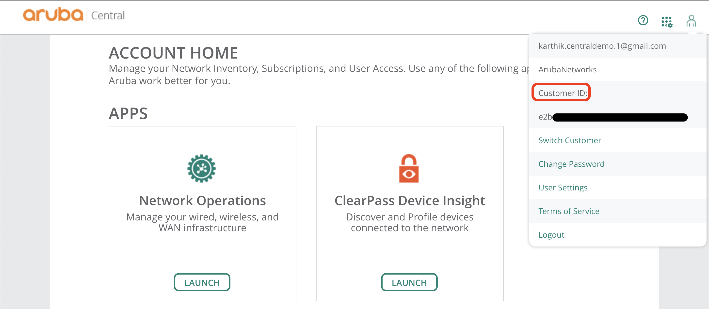

# pycentral
#### Aruba Central Python Package Index SDK

Aruba Central is an unified cloud-based network management and configuration platform for campus, branch, remote and data center networks. There are various needs for automation and programmability like automating repetitive tasks, configuring multiple devices, monitoring and more. This python package is to programmatically interact with Aruba Central via REST APIs.

### How To Install
In order to run the workflow scripts, please complete the steps below:
1. install virtual env (refer https://docs.python.org/3/library/venv.html). Make sure python version 3 is installed in system.
    ```
    $ python3 -m venv centralenv
    ```

2. Activate the virtual env
    ```
    $ source centralenv/bin/activate
    in Windows:
    $ centralenv/Scripts/activate.bat
    ```

3. Install the **pycentral** package
    ```
    (centralenv)$ pip3 install pycentral
    ```

    To install package with *extras* `colorLog` which will display log in color
    ```
    (centralenv)$ pip3 install pycentral[colorLog]
    ```

Now you can start making your script based on modules in pycentral or use different workflows from the subpackage `workflows`.

## Executing Scripts

1. Gathering variables required for the package base class `ArubaCentralBase`.

    * **base_url**: Go to `Account Home -> API Gateway -> APIs`. *All Published APs Table* will show URL under *DOCUMENTATION* column. Truncate this to end with '.com' E.G. 'https://apigw-prod2.central.arubanetworks.com/swagger/central/' must be truncated to 'https://apigw-prod2.central.arubanetworks.com'.

    * **client_id** and **client_secret**: Obtain client_id and client_secret variables by creating an API Gateway client in Aruba Central. Refer the following [documentation](https://developer.arubanetworks.com/aruba-central/docs/api-gateway-creating-application-token) for more details.

        At this point, create an API access token from the API Gateway WebUI as described in the above documentation or go further to collect other variables for the Python base class to create/manage access_token via **OAUTH APIs.**

    * **customer_id**: Obtain the **customer_id** by clicking on the figure icon on top right corner of Aruba Central WebUI.

    

    * **username** and **password**: Aruba Central user's *username* and *password*. The access token generated by the OAUTH APIs will have the same role/privileges as the provided Aruba Central user.

2. Providing input variables to the Python scripts. One of the following options can be used.
    * Provide variables directly to Aruba Central Base class in dictionary format.

        Access token approach:
        ```python
        central_info = {
            "base_url": "<api-gateway-domain-url>",
            "token": {
                "access_token": "<api-gateway-access-token>"
            }
        }
        ```

        OAUTH APIs approach with capability to generate new access token:
        ```python
            central_info = {
                "username": "<aruba-central-account-username>",
                "password": "<aruba-central-account-password>",
                "client_id": "<api-gateway-client-id>",
                "client_secret": "<api-gateway-client-secret>",
                "customer_id": "<aruba-central-customer-id>",
                "base_url": "<api-gateway-domain-url>"
            }
        ```

        Refer the sample scripts in *step3* and *step4* for examples.

    * **OR** Provide the required variables using JSON/YAML file. Refer input files [sample_scripts/input_token_only.yaml](sample_scripts/input_token_only.yaml) and [sample_scripts/input_credentials.yaml](sample_scripts/input_credentials.yaml) for information.

        Use `pycentral.workflows_utils.get_conn_from_file()` function which accepts name of the file and returns
        the `ArubaCentralBase` instance object. Refer the sample script in *step5* for example.

3. **Making API call using pycentral base**: Using the base class `ArubaCentralBase`, any Aruba Central supported REST API calls can be made. Refer the following sample script [sample_scripts/pycentral_base_sample.py](sample_scripts/pycentral_base_sample.py).

    Obtain the HTTP Request related information from Aruba Central Swagger documentation or [API references](https://developer.arubanetworks.com/aruba-central/reference) page in Aruba Developer Hub.

4. **Making API call using pycentral modules**: Some API endpoints supported by Aruba Central are implemented as modules in the Python package. Refer the following sample script using modules [sample_scripts/pycentral_module_sample.py](sample_scripts/pycentral_module_sample.py).

    To obtain a list of implemented modules and its documentation refer the [pycentral module documentation](https://pycentral.readthedocs.io/en/latest/).

5. **Using pycentral workflows**: Workflows are used to achieve an automation use-case which generally involves multiple API calls or dealing with scale and repetitive tasks with ease. Refer the sample script using workflows [sample_scripts/pycentral_workflow_sample.py](sample_scripts/pycentral_workflow_sample.py).

    Refer the [workflows](pycentral/workflows/) directory to know the supported workflows.


## Documentation:
* **Python package documentation:** [pycentral module documentation](https://pycentral.readthedocs.io/en/latest/)
* **Use-Cases and Workflows:** [Aruba Developer Hub](https://developer.arubanetworks.com/aruba-central)

## Note:
 The package takes one of the two approaches to gain access to Aruba Central APIs.

  * **OAUTH APIs:** By taking OAUTH approach to generate new access_token, the python package will cache the tokens locally for re-use. Caching tokens locally, helps preventing creation of new access_token every time the script is run. In addition, when the access_token is expired the script will attempt to use the supplied credentials and attempt to refresh the expired token.

    Override the `ArubaCentralBase.storeToken()` and `ArubaCentralBase.loadToken()` function definitions to change this behavior of caching in local file(JSON) and manage tokens more securely.

 * **Access Token**: This process is more secure. By providing only the *access_token* instead of credentials, the package will not cache the tokens. But loses the ability to handle expired token and to generate new access tokens.

## How to contribute
Please see the accompanying [CONTRIBUTIONS.md](CONTRIBUTIONS.md) file for guidelines on how to contribute to this repository.

## Troubleshooting Issues
If you encounter module import errors, make sure that the package has been installed correctly.

Additionally, please read the [RELEASE-NOTES.md](RELEASE-NOTES.md) file for the current release information and known issues.
